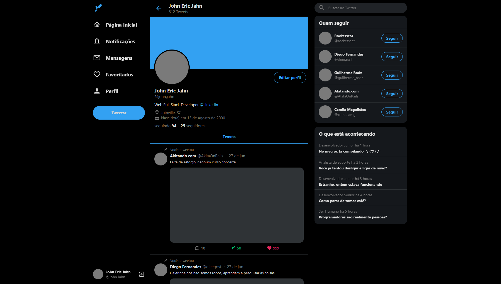
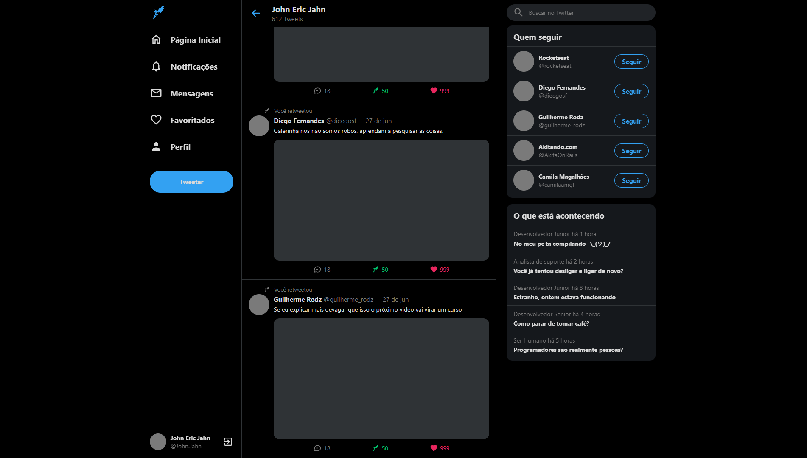
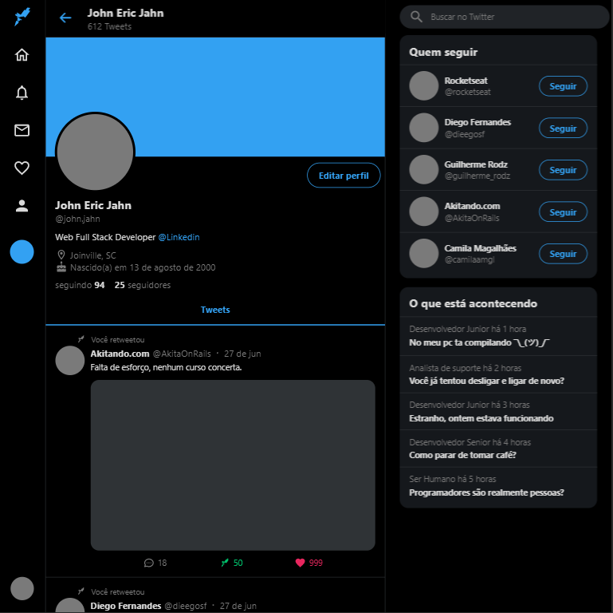
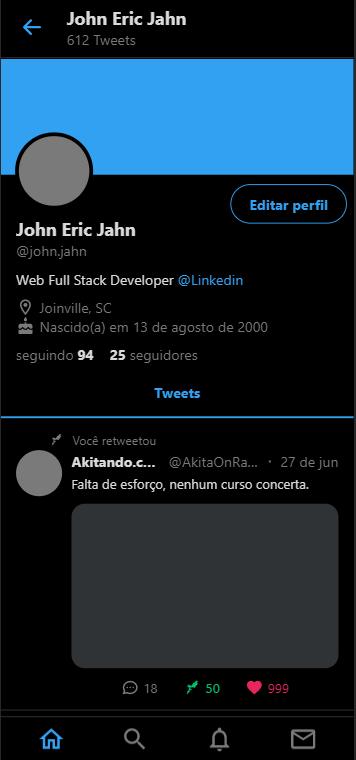

<p align="center">
  
</p>

<h1 align="center"> 
	:heavy_check_mark: Twitter Responsivo com ReactJS :heavy_check_mark:
</h1>

<p align="center">	
  <a href="www.linkedin.com/in/john-eric-jahn">
    
  </a>
  
  </a>
</p>

## :information_source: Sobre o projeto
Este projeto tem como objetivo clonar a interface do twitter, sendo o mais realista possivel.<br>
Aplicando os conceitos de FlexBox e responsividade.<br>
Foi utilizado o Eslint / Prettier / EditorConfig para padronização.<br>
Foi desenvolvido apenas para fins de estudo.

## :rocket: Tecnologias

O projeto foi desenvolvido com as seguintes tecnologias:

  - **[TypeScript][typescript]**
  - **[React][react]**
  - **[React Router Dom][react_router_dom]**
  - **[React Icons][react_icons]**
  - **[React Sticky Box][react_sticky_box]**
  - **[Styled Components][styled_components]**
  - **[Styled Icons][styled_icons]**
  - **[Eslint][eslint]**
  - **[Prettier][prettier]**
  

## 🔖 Layout

<div align="center"> 
	
	
	
	
</div>

## :information_source: Como usar?

Para rodar a aplicação, você irá precisar do [Git](https://git-scm.com) e do [Yarn](https://yarnpkg.com/) no seu computador.

Na sua linha de comando escreva:

### Install

```bash
# Clone this repository
$ git clone https://github.com/JohnEricJahn/Twitter-Clone-ReactJS

# Go into the repository
# Install dependencies
$ yarn

# Run
$ yarn start

# running on port 3000
```

## :bulb: Ideias para implementar
- [ ] Add Different Themes
- [ ] Create new routes with React Router
- [ ] Personal back-end integration:
  - [ ] User registry
  - [ ] Tweet management
  - [ ] Mentions
  - [ ] Direct messages
   
## :page_with_curl: LICENÇA

Esse repositório está licenciado pela **MIT LICENSE**. 

<!-- Techs -->
[react]: https://reactjs.org/
[typescript]: https://www.typescriptlang.org/
[react_router_dom]: https://github.com/ReactTraining/react-router/tree/master/packages/react-router-dom
[react_icons]: https://react-icons.github.io/react-icons/
[react_sticky_box]: https://www.npmjs.com/package/react-sticky-box
[eslint]: https://eslint.org/
[prettier]: https://prettier.io/
[styled_components]: https://styled-components.com/
[styled_icons]: https://styled-icons.js.org/
